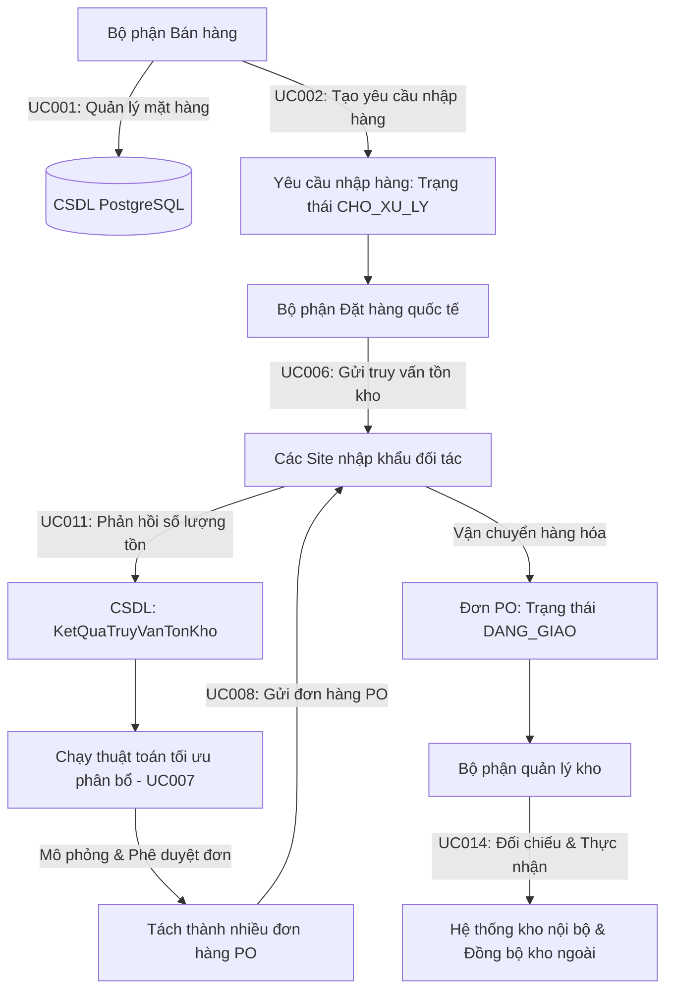

# LogiTrack B2B - Hệ thống Đặt hàng Nhập khẩu Tối ưu - Nhóm 20

Hệ thống **LogiTrack B2B** là giải pháp tin học hóa toàn diện quy trình đặt hàng nhập khẩu quốc tế, tự động hóa phân bổ tối ưu nguồn hàng và đối soát kiểm nhận nhập kho dành cho các doanh nghiệp B2B kinh doanh hàng ngoại nhập. Hệ thống giải quyết triệt để bài toán chuỗi cung ứng logistics đa phương thức (tàu biển/máy bay), tối thiểu hóa số lượng đối tác cung ứng và kiểm soát chặt chẽ sai lệch thực tế khi nhập kho.

---

## 📌 Sơ đồ Kiến trúc Nghiệp vụ Tổng quan (Mermaid)

Dưới đây là luồng vận hành khép kín từ khâu bán hàng, đặt hàng quốc tế đến kiểm nhận nhập kho bãi của hệ thống **LogiTrack B2B**:



---

## 📂 Sơ đồ Cấu trúc Cây Thư mục Dự án (FE & BE)

Dự án được thiết kế chuẩn mực theo mô hình kiến trúc phân lớp (layered architecture) phía Backend và cấu trúc App Router hiện đại phía Frontend:

```
PTPMITSS/
├── .gitignore                         
├── README.md                        
├── logitrack-backend/                 <-- BACKEND SPRING BOOT 3.X (JAVA 17)
│   ├── pom.xml                        <-- Cấu hình Maven dependencies (JPA, Web, PostgreSQL, Lombok)
│   └── src/main/
│       ├── java/com/logitrack/
│       │   ├── LogitrackBackendApplication.java <-- Khởi chạy Spring Boot
│       │   ├── controller/
│       │   │   ├── MasterController.java   <-- Toàn bộ API Endpoints, phân quyền REST API & CORS
│       │   │   └── advice/
│       │   │       └── GlobalExceptionHandler.java <-- Trả lỗi chuẩn JSON đồng bộ
│       │   ├── service/
│       │   │   ├── core/
│       │   │   │   ├── AllocationService.java  <-- Khai báo giao diện dịch vụ tách đơn
│       │   │   │   └── ReceiptService.java     <-- Khai báo giao diện dịch vụ đối soát
│       │   │   └── impl/
│       │   │       ├── AllocationServiceImpl.java <-- Lọc Greedy & Thuật toán Phân bổ tối ưu 
│       │   │       └── ReceiptServiceImpl.java    <-- Logic đối soát, rollback đồng bộ
│       │   ├── repository/
│       │   │   └── (Interface JPA Repositories quản lý truy vấn CSDL PostgreSQL)
│       │   ├── entity/
│       │   │   └── (Java Entities ánh xạ trực tiếp các bảng quan hệ PostgreSQL)
│       │   └── proxy/
│       │       └── ExternalWarehouseProxy.java   <-- Mock Client tích hợp kho ngoài
│       └── resources/
│           ├── application.properties  <-- Cấu hình 
│           ├── schema.sql              <-- Cấu trúc CSDL PostgreSQL 
│           └── data.sql                <-- Dữ liệu mẫu 
└── logitrack-frontend/                <-- FRONTEND NEXT.JS 14 (TS & TAILWIND)
    ├── package.json                   
    └── src/
        ├── app/
        │   ├── layout.tsx              <-- Bọc Google Font Outfit, ToastProvider toàn cục
        │   ├── globals.css             <-- Cấu hình Glassmorphism theme, Scrollbar, Custom animations
        │   ├── page.tsx                <-- Màn hình Đăng nhập & Xác thực vai trò
        │   └── (dashboard)/
        │       ├── layout.tsx          <-- Sidebar Menu động phân quyền theo vai trò
        │       ├── page.tsx            <-- Inventory Dashboard tổng quan
        │       ├── inventory/
        │       │   ├── page.tsx        <-- Danh mục mặt hàng (Item Catalog - Có phân trang 10 mặt hàng/trang & Tổng số lượng)
        │       │   ├── add/
        │       │   │   └── page.tsx    <-- Thêm mới vật tư (Form Quy cách, Trạng thái & Live Preview)
        │       │   └── add-request/
        │       │       └── page.tsx    <-- Lập phiếu yêu cầu đặt hàng mới
        │       ├── orders/
        │       │   ├── page.tsx        <-- Danh sách yêu cầu đã nhận/đã lập
        │       │   └── [id]/
        │       │       └── page.tsx    <-- : Xử lý Đặt hàng, Phân bổ & Tách đơn 
        │       └── receipts/
        │           ├── page.tsx        <-- Danh sách PO đang giao chờ kiểm nhận kho
        │           └── [id]/
        │               └── page.tsx    <-- Đối soát kiểm nhận kho 
        ├── components/ui/              <-- Thư viện UI Components cao cấp tự dựng (Card, Button, Table, Toast, v.v.)
        ├── types/index.ts              <-- Định nghĩa chặt chẽ Interfaces TypeScript cho dữ liệu B2B
        └── services/api.ts             <-- Axios Client cấu hình kết nối REST API Backend tập trung
```

---

## ⚙️ Hướng dẫn Cài đặt & Khởi chạy Hệ thống từ Đầu

### 1. Cấu hình Cơ sở dữ liệu (PostgreSQL)
1. Đảm bảo dịch vụ PostgreSQL đang hoạt động trên máy tính của bạn (mặc định cổng `5432`).
2. Khởi tạo một cơ sở dữ liệu mới tên là: **`logitrack`**.
3. Tài khoản kết nối mặc định của hệ thống là `postgres / postgres`. (Nếu tài khoản của bạn khác, vui lòng mở tệp [application.properties](file:///C:/Users/Dang%20Hai/PTPMITSS/logitrack-backend/src/main/resources/application.properties) để điều chỉnh).

### 2. Khởi chạy Backend (Spring Boot)
Hệ thống Backend đã được tích hợp cơ chế tự động dọn dẹp các cấu trúc bảng cũ (`DROP TABLE ... CASCADE`) và tự khởi tạo cấu trúc bảng mới (`schema.sql`), sau đó nạp dữ liệu mẫu từ tệp `data.sql` khi boot.

Mở terminal tại thư mục `logitrack-backend` và chạy lệnh sau để build và khởi động ứng dụng:
```bash
mvn spring-boot:run
```
Ứng dụng backend sẽ khởi chạy tại địa chỉ: `http://localhost:8080`

### 3. Khởi chạy Frontend (Next.js 14)
Mở terminal mới tại thư mục `logitrack-frontend` và thực hiện các lệnh sau:

```bash
# 1. Cài đặt các gói thư viện phụ thuộc
npm install

# 2. Khởi chạy môi trường phát triển (Development Server)
npm run dev
```
Giao diện người dùng sẽ sẵn sàng tại địa chỉ: `http://localhost:3000`

---

## 🔑 Tài khoản Demo phân quyền sẵn có

Đăng nhập bằng các tài khoản sau để kiểm thử trọn vẹn luồng nghiệp vụ:

| Bộ phận (Role) | Email tài khoản | Mật khẩu | Chức năng chính |
| :--- | :--- | :--- | :--- |
| **Sales Department** | `sales@logitrack.com` | `sales123` | Khai báo SKU (UC001), Lập phiếu yêu cầu mua hàng (UC002). |
| **Overseas Order Dept** | `order@logitrack.com` | `order123` | Gửi truy vấn tồn kho (UC006), Phân bổ & Tách đơn PO (UC007). |
| **Inventory Department** | `inventory@logitrack.com` | `inventory123` | Đối soát thực nhận nhập kho, Xử lý chênh lệch & Rollback (UC014). |

---

## 🚀 Kịch bản Nghiệp vụ & Hướng dẫn Thao tác Chi tiết (UC 1, 6, 7)

Dưới đây là kịch bản kiểm thử nghiệp vụ chi tiết kèm hướng dẫn thao tác từng bước trên giao diện web của hệ thống:

### 1️⃣ Use Case 1 (UC001): Quản lý danh mục mặt hàng (Bộ phận Bán hàng)

* **Ý nghĩa & Kịch bản nghiệp vụ:**
  * Bộ phận bán hàng quản lý danh mục dữ liệu gốc SKU sản phẩm (CRUD). 
  * Cung cấp các thông tin bắt buộc (Mã SKU, Tên, Đơn vị) và 2 thuộc tính mới bổ sung: **Quy cách đóng gói** (mô tả đóng gói vật lý) và **Trạng thái kinh doanh** (Đang kinh doanh / Ngừng kinh doanh).
  * **Quy tắc bảo toàn dữ liệu lịch sử:** Nếu mặt hàng đã phát sinh giao dịch (nằm trong yêu cầu đặt hàng cũ hoặc đơn PO cũ), hệ thống sẽ **chặn xóa vật lý** khỏi database, thay vào đó tự động cập nhật trạng thái mặt hàng sang `"Ngừng kinh doanh"` để bảo toàn tính toàn vẹn dữ liệu.
  * **Hỗ trợ điều hướng lướt xem phân trang:** Giao diện tích hợp thanh **Phân trang (Pagination)** hiển thị tối đa **10 dòng sản phẩm/trang** cùng khối thống kê **Tổng số lượng mặt hàng** lọc theo thời gian thực trên thanh tìm kiếm.

* **Hướng dẫn thao tác chi tiết từng bước:**
  1. **Đăng nhập:** Truy cập `http://localhost:3000`. Nhập Email `sales@logitrack.com` và Mật khẩu `sales123`. Bấm **Đăng nhập**. Giao diện sidebar bên trái sẽ tự động hiện menu dành riêng cho Sales.
  2. **Trải nghiệm Phân trang & widget Tổng số lượng:**
     * Bấm chọn menu **Danh mục Mặt hàng** (Giao diện `GUI-02`).
     * **Quan sát:** Ở trên thanh bộ lọc tìm kiếm xuất hiện một Widget nhỏ gọn cực kỳ tinh tế ghi nhận: `Tổng số: [N] mặt hàng` (ví dụ: `Tổng số: 35 mặt hàng`). Số lượng này tự động tăng/giảm động khi bạn nhập từ khóa tìm kiếm.
     * **Quan sát:** Ở phía dưới đáy bảng danh sách xuất hiện **Thanh phân trang (Pagination Control)** có các nút chuyển trang `<` `1` `2` `3` `4` `>` và dòng thống kê: `Hiển thị dòng 1 đến 10 trong tổng số 35 mặt hàng`. 
     * Thử bấm nút số `2`, `3` hoặc nút `>` để chuyển trang mượt mà.
  3. **Thêm mới SKU:**
     * Click nút màu xanh **Khai báo Vật tư mới** (Giao diện `GUI-03`).
     * Nhập Mã SKU (Bắt buộc bắt đầu bằng `"SKU-"`, ví dụ: `SKU-MON-009`).
     * Chọn Đơn vị tính (ví dụ: `Chiếc`).
     * Nhập Tên mặt hàng (ví dụ: `Bàn phím cơ không dây AKKO 3098`).
     * Nhập **Quy cách đóng gói** (ví dụ: `1 chiếc/hộp`).
     * Chọn **Trạng thái kinh doanh**: `Đang kinh doanh`.
     * Chọn Danh mục: `Accessories`.
     * **Quan sát:** Ở bên phải màn hình, khối **Live Preview Card** cao cấp màu tối sẽ tự động cập nhật diện mạo sản phẩm, hiển thị trực quan thông số Quy cách đóng gói và huy hiệu (Badge) `"Đang kinh doanh"` màu xanh lá cây theo thời gian thực (real-time) khi bạn đang gõ phím.
     * Bấm **Khai báo sản phẩm** để gửi dữ liệu lên Backend. Hệ thống hiển thị Toast thành công và điều hướng về bảng danh sách mặt hàng. Bạn sẽ quan sát thấy widget **Tổng số mặt hàng** tăng lên 36.
  4. **Chỉnh sửa thông tin:**
     * Tìm dòng mặt hàng vừa tạo trên bảng. Bấm nút **Sửa**.
     * Hộp thoại Modal sửa sẽ hiện lên ở giữa màn hình. Hãy thay đổi Quy cách đóng gói thành `1 chiếc/hộp - Bản 2026` và chọn Trạng thái kinh doanh là `Ngừng kinh doanh`.
     * Bấm **Lưu thay đổi**. Bảng sẽ tự động cập nhật và hiển thị huy hiệu trạng thái màu đỏ bắt mắt.
  5. **Kiểm thử logic xóa bảo toàn (Xóa mềm):**
     * Tìm một mặt hàng mẫu đã có lịch sử giao dịch (ví dụ: `SKU-MON-001` - Màn hình LG UltraGear đã nằm trong đơn PO mẫu).
     * Bấm nút **Xóa** ở cột cuối. Hệ thống hiển thị hộp thoại xác nhận. Bấm **Đồng ý xóa**.
     * **Kết quả quan sát:** Do mặt hàng đã có dữ liệu PO lịch sử liên quan, Backend tự động chuyển trạng thái của SKU này sang `"Ngừng kinh doanh"` và trả về Toast thông báo: *"Mặt hàng này đã có lịch sử giao dịch! Hệ thống tự động chuyển trạng thái sang 'Ngừng kinh doanh' để bảo toàn dữ liệu lịch sử."* Bản ghi vẫn được giữ nguyên vẹn trên CSDL và cập nhật huy hiệu màu đỏ thay vì bị xóa vật lý!

---

### 2️⃣ Use Case 6 (UC006): Truy vấn thông tin tồn kho và vận chuyển (BP Đặt hàng quốc tế)

* **Ý nghĩa & Kịch bản nghiệp vụ:**
  * Trước khi tách đơn đặt hàng, BP Đặt hàng quốc tế phải thực hiện gửi thông điệp truy vấn thăm dò lượng tồn kho khả dụng thực tế của tất cả các SKU trong yêu cầu tại các Site cung ứng đối tác nước ngoài.
  * Hệ thống tự động quét cơ sở dữ liệu, lọc ra danh sách các Site có kinh doanh ít nhất một mặt hàng, sinh thông điệp hỏi tồn kho, và cập nhật trạng thái yêu cầu sang `"Đang chờ Site phản hồi"`. Đây là điều kiện bắt buộc để mở khóa chức năng chạy thuật toán phân bổ.
  * Nếu không tìm thấy Site đối tác nào cung cấp các mặt hàng đó, hệ thống sẽ báo lỗi và cập nhật trạng thái yêu cầu sang `"Không thể đáp ứng"`.

* **Hướng dẫn thao tác chi tiết từng bước:**
  1. **Đăng nhập:** Đăng nhập bằng tài khoản Đặt hàng quốc tế: Email `order@logitrack.com` / Mật khẩu `order123`.
  2. **Xem yêu cầu:** Chọn menu **Yêu cầu Đặt hàng** (Giao diện `GUI-06`). Bạn sẽ nhìn thấy danh sách các phiếu yêu cầu do Sales lập.
  3. **Thao tác truy vấn:**
     * Tìm một phiếu yêu cầu đang ở trạng thái **Chờ xử lý** (màu cam). Bấm nút **Xử lý phân bổ** ở cột cuối để vào màn hình chi tiết.
     * Tại giao diện chi tiết, nút *"Kích hoạt phân bổ tối ưu"* lúc này đang bị khóa (Disabled) và hiển thị cảnh báo *"Vui lòng gửi truy vấn tồn kho tới các Site đối tác trước khi chạy thuật toán phân bổ!"*.
     * Bạn bấm nút **Gửi truy vấn tồn kho** (Giao diện `GUI-07`).
     * **Kết quả quan sát:** Hệ thống thực hiện quét tìm Site và gửi API truy vấn thành công. Trạng thái phiếu yêu cầu lập tức chuyển sang **Đang chờ Site phản hồi** (màu xanh dương). Đồng thời, hiển thị một **Pop-up blur-overlay premium** thông báo: *"Đã gửi phiếu truy vấn thành công tới [N] site đối tác. Hệ thống đã cập nhật kết quả tồn kho khả dụng!"*. Lúc này, nút chạy thuật toán phân bổ sẽ chính thức được mở khóa (Enabled).

---

### 3️⃣ Use Case 7 (UC007): Xử lý yêu cầu và Tách đơn hàng (BP Đặt hàng quốc tế)

* **Ý nghĩa & Kịch bản nghiệp vụ:**
  * Đây là trái tim giải thuật của hệ thống. Chạy thuật toán tối ưu phân bổ 1 phiếu yêu cầu gom nhu cầu thành các đơn đặt hàng PO xuất khẩu gửi đi các Site nước ngoài.
  * **Quy tắc rẽ nhánh tối ưu của thuật toán:**
    * **Ưu tiên 1 (Phương thức vận chuyển):** Lấy ngày hiện tại cộng với số ngày vận chuyển của Site. Ưu tiên đi đường tàu biển (`ship delivery` - chi phí siêu rẻ) trước nếu kịp ngày cần hàng mong muốn của Sales. Nếu trễ hạn, tự động chuyển sang thử đi đường hàng không (`air delivery` - chi phí cao). Nếu đi máy bay vẫn trễ hạn -> Loại bỏ đối tác đó khỏi danh sách khả thi cho SKU này.
    * **Ưu tiên 2 (Tồn kho khả dụng):** Sắp xếp giảm dần các Site đối tác khả thi theo số lượng tồn kho khả dụng lớn nhất.
    * **Ưu tiên 3 (Greedy gom hàng tối thiểu đối tác):** Gom tối đa số lượng cần từ Site có tồn kho lớn nhất, nếu còn thiếu mới gom tiếp sang Site tiếp theo để số lượng Site phải đặt hàng cho SKU đó là nhỏ nhất (giảm chi phí quản lý vận hành).
  * **Chức năng Manual Override cao cấp:** Hỗ trợ nhân viên tự điều chỉnh phương án phân bổ bằng tay trên UI (đổi Site, đổi phương tiện vận chuyển qua Dropdown, nhập lại số lượng phân bổ) và hiển thị trạng thái lệch số lượng thời gian thực.
  * **Bảo toàn giao dịch (Rollback):** Nếu tổng tồn kho của các Site không đủ đáp ứng, Backend ném lỗi và hủy bỏ toàn bộ tiến trình ghi database, tránh phát sinh PO rác.

* **Hướng dẫn thao tác chi tiết từng bước:**
  1. **Kích hoạt thuật toán tự động:**
     * Tại màn hình chi tiết yêu cầu sau khi đã gửi truy vấn ở Bước 2, bấm nút **Kích hoạt phân bổ tối ưu**.
     * **Kết quả quan sát:** Màn hình sẽ hiển thị bảng đề xuất phân bổ cực kỳ trực quan. Ví dụ: Với SKU-MON-001 cần 50 cái, thuật toán đề xuất: tách mua 35 cái ở `SITE-JP-001` (đi tàu biển - 15 ngày) và 15 cái ở `SITE-SG-001` (đi máy bay - 3 ngày) để vừa kịp hạn giao vừa tối ưu chi phí!
  2. **Thao tác Manual Override (Điều chỉnh thủ công):**
     * Để thử cấu hình bằng tay: Tại dòng sản phẩm, bạn bấm vào Dropdown chọn Site khả thi khác (ví dụ: đổi từ `SITE-JP-001` sang `SITE-US-001`).
     * Đổi phương tiện vận chuyển sang `air delivery`.
     * Thay đổi số lượng thực đặt tại ô nhập liệu.
     * **Quan sát:** Ở cột trạng thái bên phải, hệ thống sẽ tự động đối chiếu số lượng thực đặt với số lượng yêu cầu ban đầu. Nếu tổng số lượng nhập thủ công chưa khớp hoặc vượt quá tồn kho khả dụng của Site, hệ thống hiển thị Badge màu đỏ cảnh báo `"Lệch: [N]"` và khóa nút duyệt đơn. Khi bạn chỉnh sửa số lượng khớp hoàn toàn, Badge lập tức chuyển sang màu xanh lá cây `"Đã Khớp"` rất bắt mắt!
  3. **Xác nhận & Phát hành đơn PO:**
     * Khi đã hài lòng với phương án phân bổ, bạn bấm nút **Xác nhận & Sinh đơn PO**.
     * **Kết quả quan sát:** Backend sẽ khởi chạy transaction đồng bộ: Tự động trừ tồn kho đối tác trên database, tạo ra các vận đơn đặt hàng PO gốc ở trạng thái `DANG_GIAO`, chuyển trạng thái yêu cầu đặt hàng sang `DA_XU_LY`. Hệ thống bắn Toast thành công rực rỡ và điều hướng về trang danh sách!

---

## 📊 Danh sách 25 Kịch bản Dữ liệu Kiểm thử Tích hợp (UC006 & UC007)

Hệ thống đã được nạp sẵn bộ dữ liệu mẫu hạt giống khổng lồ gồm **25 kịch bản kiểm thử độc lập** (từ `REQ-2026-005` đến `REQ-2026-029`) được chèn sẵn vào CSDL qua `data.sql` để hai bạn và thầy cô dễ dàng kiểm nghiệm và đánh giá chất lượng phần mềm:

### 1. Nhóm kiểm thử Use Case 6 (Truy vấn thông tin tồn kho và vận chuyển)
*Các phiếu này mặc định ở trạng thái **`CHO_XU_LY`** (Màu cam - Chờ tiếp nhận) trong danh sách phiếu của bộ phận Đặt hàng.*

#### **A. Kịch bản Truy vấn Thành công (Kho đối tác có hàng):**
Khi chọn phiếu và click **`Gửi truy vấn`**, hệ thống tìm thấy tồn kho khả dụng $\rightarrow$ Thông báo thành công và chuyển sang **`Đang chờ Site phản hồi`** (xanh dương).
* **`REQ-2026-005`**: Yêu cầu 10 Laptop MacBook Air (`SKU-LAP-001`) nhận ngày `15/06/2026`. (Tồn kho Seoul 25, LA 40 $\rightarrow$ Khả dụng).
* **`REQ-2026-006`**: Yêu cầu 20 iPad Air 5 (`SKU-TAB-001`) nhận ngày `20/06/2026`. (Tồn kho Seoul 40, LA 65 $\rightarrow$ Khả dụng).
* **`REQ-2026-007`**: Yêu cầu 15 Webcam Logitech (`SKU-CAM-001`) nhận ngày `08/06/2026`. (Tồn kho Seoul 70 $\rightarrow$ Khả dụng).
* **`REQ-2026-008`**: Yêu cầu hỗn hợp: 5 màn hình Dell (`SKU-MON-001`) + 10 bàn phím Logitech (`SKU-KEY-002`) nhận ngày `10/06/2026`.
* **`REQ-2026-009`**: Yêu cầu 100 cuộn Cáp mạng Cat6 (`SKU-CAB-003`) nhận ngày `05/06/2026`. (Tồn kho Shenzhen 300, Bangkok 400 $\rightarrow$ Khả dụng).

#### **B. Kịch bản Truy vấn Thất bại (Kho đối tác HẾT SẠCH hàng):**
Khi click **`Gửi truy vấn`**, do không có site đối tác nào có tồn kho của sản phẩm này $\rightarrow$ Hệ thống tự động báo lỗi và chuyển sang trạng thái **`Không thể đáp ứng`** (màu đỏ).
* **`REQ-2026-010`**: Yêu cầu 5 chiếc Micro Rode (`SKU-MIC-001`) nhận ngày `12/06/2026`. (SKU-MIC-001 được cố ý thiết lập tồn kho = 0 trên toàn cầu để test lỗi).
* **`REQ-2026-011`**: Yêu cầu hỗn hợp chứa sản phẩm hết hàng: 10 bàn phím Keychron + 2 Micro thu âm Rode (`SKU-MIC-001`) nhận ngày `15/06/2026`.
* **`REQ-2026-012`**: Yêu cầu 1 chiếc Micro thu âm Rode (`SKU-MIC-001`) nhận ngày `07/06/2026`.

---

### 2. Nhóm kiểm thử Use Case 7 (Phân bổ tối ưu & Tách Site)
*Các phiếu này đã qua bước truy vấn tồn kho, mặc định ở trạng thái **`DANG_CHO_PHAN_HOI`** (Màu xanh dương) để test ngay chức năng kích hoạt phân bổ.*

#### **A. Kịch bản phân bổ thành công (Đủ hàng & Kịp tiến độ):**
* **`REQ-2026-013` (Tự động đi Tàu biển giá rẻ):** Yêu cầu 40 Màn Dell (`SKU-MON-001`) nhận ngày `10/06/2026` (Hạn 11 ngày).
  * *Thuật toán đề xuất:* Shenzhen đi tàu mất 7 ngày <= 11 ngày $\rightarrow$ Đề xuất đi Tàu biển Shenzhen (`ship delivery`).
* **`REQ-2026-014` (Tự động chuyển sang đi Máy bay vì đi Tàu trễ):** Yêu cầu 30 Tai nghe Sony WH-1000XM5 (`SKU-EAR-001`) nhận ngày `04/06/2026` (Hạn khẩn cấp 5 ngày).
  * *Thuật toán đề xuất:* Tokyo đi tàu mất 10 ngày (trễ), đi máy bay mất 3 ngày <= 5 ngày $\rightarrow$ Đề xuất Máy bay Tokyo (`air delivery`).
* **`REQ-2026-015` (Tự chọn đối tác tối ưu có tồn kho lớn nhất):** Yêu cầu 100 Bàn phím Keychron (`SKU-KEY-001`) nhận ngày `06/06/2026` (Hạn 7 ngày).
  * *Thuật toán đề xuất:* Lọc các Site kịp hạn và gom trọn 100 chiếc tại Shenzhen (tàu 7 ngày).
* **`REQ-2026-016` (Tự động TÁCH SITE tối thiểu hóa nhà cung cấp):** Yêu cầu 150 Chuột Logitech MX Master 3S (`SKU-MOU-001`) nhận ngày `09/06/2026` (Hạn 10 ngày).
  * *Thuật toán đề xuất:* Seoul (tàu 5 ngày, tồn 100), Shenzhen (tàu 7 ngày, tồn 80). Sắp xếp tồn kho giảm dần và đề xuất: gom 100 chiếc từ Seoul (ship) và 50 chiếc từ Shenzhen (ship).
* **`REQ-2026-017` (Phân bổ đi máy bay site xa):** Yêu cầu 30 MacBook Air M2 (`SKU-LAP-001`) nhận ngày `15/06/2026`. Đề xuất Máy bay LA (3 ngày).
* **`REQ-2026-018` (Tách Site đi Tàu biển):** Yêu cầu 80 máy tính bảng iPad Air 5 (`SKU-TAB-001`) nhận ngày `25/06/2026`. Đề xuất: 65 chiếc từ LA (ship) + 15 chiếc từ Seoul (ship).
* **`REQ-2026-019` (Chọn Site gần chi phí rẻ nhất):** Yêu cầu 200 Cáp HDMI (`SKU-CAB-001`) nhận ngày `05/06/2026`. Đề xuất: 200 cái tại Bangkok đi tàu (3 ngày).

#### **B. Kịch bản phân bổ thất bại (Lỗi popup đỏ trên UI):**
* **`REQ-2026-020` (Thất bại do Thiếu hàng diện rộng):** Yêu cầu 300 Màn Dell (`SKU-MON-001`). 
  * *Kết quả:* Tổng tồn kho toàn cầu chỉ có 160 chiếc $\rightarrow$ Popup đỏ báo lỗi thiếu 140 chiếc.
* **`REQ-2026-021` (Thất bại do Thiếu hàng cục bộ):** Yêu cầu 200 Tai nghe Marshall Major IV (`SKU-EAR-003`).
  * *Kết quả:* Tổng tồn kho chỉ có 180 cái $\rightarrow$ Báo lỗi thiếu 20 cái.
* **`REQ-2026-022` (Thất bại do khẩn cấp - Giao trong ngày):** Yêu cầu 10 chiếc MacBook Air M2 nhận ngày `30/05/2026` (Hôm nay!).
  * *Kết quả:* Kể cả đi máy bay nhanh nhất cũng mất 1 ngày $\rightarrow$ Báo lỗi trễ hạn cả 2 phương thức.
* **`REQ-2026-023` (Thất bại do trễ hạn cả 2 phương thức vận chuyển):** Yêu cầu 15 Máy ảnh Sony Alpha (`SKU-CAM-002`) nhận ngày `01/06/2026` (Trong 2 ngày).
  * *Kết quả:* Tokyo đi máy bay mất 3 ngày, Frankfurt mất 4 ngày $\rightarrow$ Báo lỗi trễ hạn.
* **`REQ-2026-024` (Thất bại do thiếu hàng ở Site duy nhất):** Yêu cầu 50 chiếc Ghế công thái học (`SKU-CHA-001`).
  * *Kết quả:* Chỉ có Bangkok có tồn kho 35 cái $\rightarrow$ Báo lỗi thiếu 15 cái.

---

### 3. Nhóm các phiếu trạng thái lịch sử đặc biệt
* **Đã hoàn tất phân bổ & sinh đơn PO thành công (`DA_XU_LY`):** `REQ-2026-025`, `REQ-2026-026`, `REQ-2026-027` (đã liên kết chặt chẽ với các PO tương ứng trong CSDL).
* **Không thể đáp ứng lịch sử (`KHONG_THE_DAP_UNG`):** `REQ-2026-028`.
* **Đã chủ động hủy đơn bởi nhân viên (`DA_HUY`):** `REQ-2026-029`.


