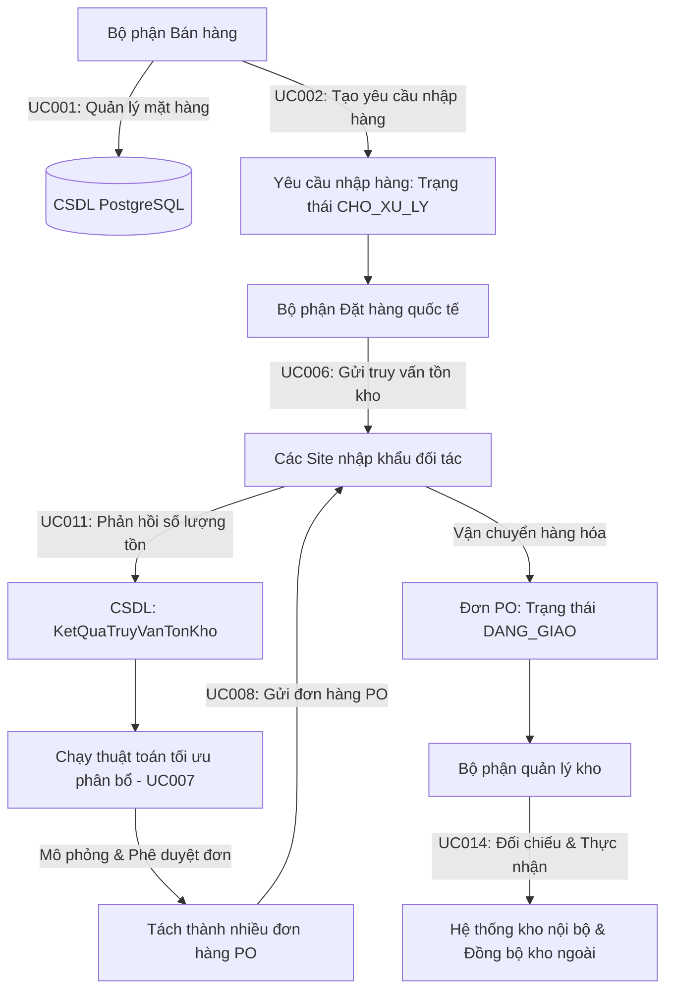

# LogiTrack B2B - Hệ thống Đặt hàng Nhập khẩu Tối ưu - Nhóm 20

Hệ thống **LogiTrack B2B** là giải pháp tin học hóa toàn diện quy trình đặt hàng nhập khẩu quốc tế, tự động hóa phân bổ tối ưu nguồn hàng và đối soát kiểm nhận nhập kho dành cho các doanh nghiệp B2B kinh doanh hàng ngoại nhập. Hệ thống giải quyết triệt để bài toán chuỗi cung ứng logistics đa phương thức (tàu biển/máy bay), tối thiểu hóa số lượng đối tác cung ứng và kiểm soát chặt chẽ sai lệch thực tế khi nhập kho.

---

## 📌 Sơ đồ Kiến trúc Nghiệp vụ Tổng quan (Mermaid)

Dưới đây là luồng vận hành khép kín từ khâu bán hàng, đặt hàng quốc tế đến kiểm nhận nhập kho bãi của hệ thống **LogiTrack B2B**:



---

## 📂 Sơ đồ Cấu trúc Cây Thư mục Dự án (FE & BE)

Dự án được thiết kế chuẩn mực theo mô hình kiến trúc phân lớp (layered architecture) phía Backend và cấu trúc App Router hiện đại phía Frontend:

```
PTPMITSS/
├── .gitignore                         
├── README.md                        
├── logitrack-backend/                 <-- BACKEND SPRING BOOT 3.X (JAVA 17)
│   ├── pom.xml                        <-- Cấu hình Maven dependencies (JPA, Web, PostgreSQL, Lombok)
│   └── src/main/
│       ├── java/com/logitrack/
│       │   ├── LogitrackBackendApplication.java <-- Khởi chạy Spring Boot
│       │   ├── controller/
│       │   │   ├── MasterController.java   <-- API Endpoints, phân quyền REST API & CORS
│       │   │   └── advice/
│       │   │       └── GlobalExceptionHandler.java <-- Trả lỗi chuẩn JSON đồng bộ
│       │   ├── service/
│       │   │   ├── core/
│       │   │   │   ├── AllocationService.java  <-- Giao diện dịch vụ tách đơn
│       │   │   │   └── ReceiptService.java     <-- Giao diện dịch vụ đối soát
│       │   │   └── impl/
│       │   │       ├── AllocationServiceImpl.java <-- Greedy & Thuật toán Phân bổ tối ưu 
│       │   │       └── ReceiptServiceImpl.java    <-- Logic đối soát, rollback đồng bộ
│       │   ├── repository/
│       │   │   └── (Interface JPA Repositories quản lý truy vấn CSDL PostgreSQL)
│       │   ├── entity/
│       │   │   └── (Java Entities ánh xạ trực tiếp các bảng quan hệ PostgreSQL)
│       │   └── proxy/
│       │       └── ExternalWarehouseProxy.java   <-- Mock Client tích hợp kho ngoài
│       └── resources/
│           ├── application.properties  <-- Cấu hình kết nối DB và ứng dụng
│           ├── schema.sql              <-- Cấu trúc CSDL PostgreSQL 
│           └── data.sql                <-- Dữ liệu mẫu & 90 kịch bản test mới nạp sẵn
├── logitrack-frontend/                <-- FRONTEND NEXT.JS 14 (TS & TAILWIND)
│   ├── package.json                   
│   └── src/
│       ├── app/
│       │   ├── layout.tsx              <-- Bọc Google Font Outfit, ToastProvider toàn cục
│       │   ├── globals.css             <-- Glassmorphism theme, Custom animations
│       │   ├── page.tsx                <-- Màn hình Đăng nhập & Xác thực vai trò
│       │   └── dashboard/
│       │       ├── layout.tsx          <-- Sidebar Menu động phân quyền theo vai trò
│       │       ├── page.tsx            <-- Inventory Dashboard tổng quan
│       │       ├── inventory/
│       │       │   ├── page.tsx        <-- Danh mục mặt hàng (Phân trang & Tổng số lượng)
│       │       │   ├── add/
│       │       │   │   └── page.tsx    <-- Thêm mới vật tư & Live Preview
│       │       │   └── add-request/
│       │       │       └── page.tsx    <-- Lập phiếu yêu cầu đặt hàng mới
│       │       ├── orders/
│       │       │   ├── page.tsx        <-- Danh sách yêu cầu đã nhận/đã lập
│       │       │   └── [id]/
│       │       │       └── page.tsx    <-- Xử lý Đặt hàng, Phân bổ & Tách đơn 
│       │       └── receipts/
│       │           ├── page.tsx        <-- Danh sách PO đang giao chờ kiểm nhận kho
│       │           └── [id]/
│       │               └── page.tsx    <-- Đối soát kiểm nhận kho 
│       ├── components/ui/              <-- Thư viện UI Components cao cấp (Card, Button, Table, Toast, v.v.)
│       ├── types/index.ts              <-- Interfaces TypeScript cho dữ liệu B2B
│       └── services/api.ts             <-- Axios Client cấu hình kết nối REST API Backend
└── logitrack-desktop/                 <-- PHÂN HỆ DESKTOP ELECTRON (KIẾN TRÚC TÍCH HỢP)
    ├── package.json                   <-- Cấu hình Electron-builder & scripts đóng gói dist
    ├── main.js                        <-- Script điều khiển chính Electron, quản lý background processes (Spring Boot JAR & Next.js) và tự động dò tìm JDK 17+ trên Windows
    ├── bin/
    │   └── logitrack-backend.jar      <-- File chạy Backend Spring Boot sau khi đóng gói
    └── scripts/
        └── build.js                   <-- Tập lệnh build tích hợp 1-click (mvn compile, npm build, copy JAR)
```

---

## ⚙️ Hướng dẫn Cài đặt & Khởi chạy Hệ thống từ Đầu

### 1. Cấu hình Cơ sở dữ liệu (PostgreSQL)
1. Đảm bảo dịch vụ PostgreSQL đang hoạt động trên máy tính của bạn (mặc định cổng `5432`).
2. Khởi tạo một cơ sở dữ liệu mới tên là: **`logitrack`**.
3. Tài khoản kết nối mặc định của hệ thống là `postgres / postgres`. (Nếu tài khoản của bạn khác, vui lòng mở tệp [application.properties](file:///C:/Users/Dang%20Hai/PTPMITSS/logitrack-backend/src/main/resources/application.properties) để điều chỉnh).

### 2. Khởi chạy Backend (Spring Boot)
Hệ thống Backend đã được tích hợp cơ chế tự động dọn dẹp các cấu trúc bảng cũ (`DROP TABLE ... CASCADE`) và tự khởi tạo cấu trúc bảng mới (`schema.sql`), sau đó nạp dữ liệu mẫu từ tệp `data.sql` khi boot.

Mở terminal tại thư mục `logitrack-backend` và chạy lệnh sau để build và khởi động ứng dụng:
```bash
mvn spring-boot:run
```
Ứng dụng backend sẽ khởi chạy tại địa chỉ: `http://localhost:8080`

### 3. Khởi chạy Frontend (Next.js 14)
Mở terminal mới tại thư mục `logitrack-frontend` và thực hiện các lệnh sau:

```bash
# 1. Cài đặt các gói thư viện phụ thuộc
npm install

# 2. Khởi chạy môi trường phát triển (Development Server)
npm run dev
```
Giao diện người dùng sẽ sẵn sàng tại địa chỉ: `http://localhost:3000`

### 4. Khởi chạy Phân hệ Desktop (Electron đóng gói tích hợp 1-click)
Phân hệ `logitrack-desktop` cung cấp giải pháp khởi chạy tích hợp 1-click toàn bộ hệ thống (tự chạy ngầm Spring Boot JAR, khởi động Server Next.js song song và hiển thị giao diện Desktop Electron).

**Yêu cầu hệ thống:**
* Máy tính Windows đã cài đặt JDK $\ge 17$ (Mã nguồn trong `main.js` tự động tìm kiếm JDK $\ge 17$ cao nhất tại thư mục mặc định `C:\Program Files\Java`).
* Đã cài đặt Node.js và Maven.

**Các bước chạy thử nghiệm (Development Mode):**
1. Mở terminal tại thư mục `logitrack-desktop`.
2. Cài đặt các gói phụ thuộc:
   ```bash
   npm install
   ```
3. Chạy tập lệnh Node build tự động:
   ```bash
   node scripts/build.js
   ```
   *Lưu ý:* Tập lệnh này sẽ tự động compile Backend Spring Boot thành file JAR, copy vào `logitrack-desktop/bin/logitrack-backend.jar`, đồng thời compile build Frontend Next.js.
4. Chạy ứng dụng Desktop:
   ```bash
   npm start
   ```
   *Lưu ý:* Ứng dụng sẽ chiếm dụng cổng `8080` (Backend) và `3000` (Frontend) trên máy cục bộ khi chạy. Khi đóng cửa sổ Desktop, Electron sẽ tự động tắt sạch các tiến trình chạy ngầm bằng `taskkill`.

**Đóng gói bộ cài đặt Windows (.exe):**
Để đóng gói thành bộ cài đặt độc lập cài qua NSIS hoặc bản chạy di động (portable) không cần cài đặt:
```bash
npm run dist
```
Các file cài đặt sau khi đóng gói sẽ nằm trong thư mục `logitrack-desktop/dist/`.


---

## 🔑 Tài khoản Demo phân quyền sẵn có

Đăng nhập bằng các tài khoản sau để kiểm thử trọn vẹn luồng nghiệp vụ:

| Bộ phận (Role) | Email tài khoản | Mật khẩu | Chức năng chính |
| :--- | :--- | :--- | :--- |
| **Sales Department** | `sales@logitrack.com` | `sales123` | Khai báo SKU (UC001), Lập phiếu yêu cầu mua hàng (UC002), Theo dõi trạng thái yêu cầu đặt hàng (UC003), Theo dõi chuyến PO ở chế độ Chỉ đọc. |
| **Overseas Order Dept** | `order@logitrack.com` | `order123` | Quản lý Site đối tác (UC004), Tiếp nhận yêu cầu mua hàng (UC005), Gửi truy vấn tồn kho (UC006), Phân bổ & Tách đơn PO (UC007), Phát hành đơn PO (UC008), Theo dõi chuyến PO ở chế độ Chỉ đọc. |
| **Inventory Department** | `inventory@logitrack.com` | `inventory123` | Xem đơn PO đang giao (UC013), Đối soát thực nhận nhập kho, Xử lý chênh lệch & Rollback (UC014). |

---

## 🚀 Kịch bản Nghiệp vụ & Hướng dẫn Thao tác Chi tiết (10 Use Case Cốt lõi)

Dưới đây là cẩm nang kịch bản kiểm thử nghiệp vụ chi tiết kèm hướng dẫn thao tác từng bước trên giao diện web của hệ thống LogiTrack B2B:

### 1️⃣ Use Case 1 (UC001): Quản lý danh mục mặt hàng (Bộ phận Bán hàng)

* **Tài khoản sử dụng:** `sales@logitrack.com` / `sales123` (Vai trò `SALES`)
* **Ý nghĩa & Kịch bản nghiệp vụ:**
  * Quản lý danh mục sản phẩm (SKU) bao gồm các thông tin bắt buộc: Mã SKU, Tên, Đơn vị tính, cùng 2 thuộc tính mới bổ sung: **Quy cách đóng gói** (bao bì vật lý) và **Trạng thái kinh doanh** (Đang kinh doanh / Ngừng kinh doanh).
  * **Quy tắc bảo toàn dữ liệu lịch sử:** Nếu mặt hàng đã phát sinh giao dịch (nằm trong yêu cầu đặt hàng cũ hoặc đơn PO cũ), hệ thống sẽ **chặn xóa vật lý** khỏi database, tự động chuyển trạng thái sang `"Ngừng kinh doanh"` để bảo toàn tính toàn vẹn dữ liệu.
  * **Hỗ trợ phân trang & widget đếm tổng:** Giao diện tích hợp thanh **Phân trang** hiển thị tối đa **10 dòng sản phẩm/trang** cùng khối thống kê **Tổng số lượng mặt hàng** lọc theo thời gian thực.
* **Hướng dẫn thao tác chi tiết từng bước:**
  1. **Đăng nhập:** Đăng nhập bằng tài khoản `sales@logitrack.com` / `sales123`.
  2. **Trải nghiệm Phân trang & widget Tổng số lượng:** Bấm chọn menu **Danh mục Mặt hàng**. Ở trên thanh bộ lọc tìm kiếm xuất hiện Widget: `Tổng số: [N] mặt hàng` tự động cập nhật khi tìm kiếm. Ở phía dưới đáy bảng xuất hiện thanh phân trang có các nút `<` `1` `2` `3` `>` để chuyển trang mượt mà.
  3. **Thêm mới SKU:** Click nút **Khai báo Vật tư mới**. Nhập Mã SKU (bắt đầu bằng `"SKU-"`, ví dụ: `SKU-MON-009`), Đơn vị tính, Tên mặt hàng, **Quy cách đóng gói** (ví dụ: `1 chiếc/hộp`), chọn **Trạng thái kinh doanh**: `Đang kinh doanh`. Khối **Live Preview Card** màu tối ở bên phải tự động hiển thị trực quan thông số theo thời gian thực. Bấm **Khai báo sản phẩm** để lưu.
  4. **Chỉnh sửa thông tin:** Tìm dòng mặt hàng vừa tạo trên bảng. Bấm nút **Sửa** (Modal sửa hiện lên), thay đổi Quy cách hoặc Trạng thái, bấm **Lưu thay đổi**.
  5. **Kiểm thử logic xóa bảo toàn (Xóa mềm):** Tìm mặt hàng mẫu đã có lịch sử giao dịch (ví dụ: `SKU-MON-001`). Bấm **Xóa** ở cột cuối. Xác nhận đồng ý.
* **Các tình huống Thành công / Thất bại:**
  * **Thành công (Khai báo/Sửa mới):** Dữ liệu được lưu trữ an toàn trong DB, Toast xanh lá xuất hiện, widget đếm tổng số tăng lên.
  * **Thành công (Xóa mềm bảo toàn dữ liệu):** Đối với các mặt hàng đã có giao dịch lịch sử, hệ thống chặn xóa vật lý, tự động đổi trạng thái sang "Ngừng kinh doanh" (badge màu đỏ), bắn Toast thông báo giải thích.
  * **Thất bại (Trùng SKU):** Khai báo mã SKU đã tồn tại trên hệ thống -> Backend ném lỗi trùng khóa chính, Toast lỗi màu đỏ xuất hiện.
  * **Thất bại (Không đúng định dạng SKU):** Nhập mã SKU không bắt đầu bằng `"SKU-"` -> Hệ thống báo lỗi định dạng mã vật tư.

### 2️⃣ Use Case 2 (UC002): Tạo yêu cầu nhập hàng (Bộ phận Bán hàng)

* **Tài khoản sử dụng:** `sales@logitrack.com` / `sales123` (Vai trò `SALES`)
* **Ý nghĩa & Kịch bản nghiệp vụ:**
  * Gom nhu cầu đặt mua sản phẩm từ kinh doanh thực tế để gửi yêu cầu đặt hàng về bộ phận Đặt hàng quốc tế. Yêu cầu có thể chứa một hoặc nhiều dòng sản phẩm (SKU, số lượng đặt, đơn vị, ngày nhận mong muốn).
* **Hướng dẫn thao tác chi tiết từng bước:**
  1. Click chọn menu **Phiếu Yêu Cầu**.
  2. Click nút **Tạo yêu cầu mới** ở góc trên bên phải. Hệ thống tự động sinh Mã phiếu nháp (ví dụ: `REQ-2026-XXXX`).
  3. Tại bảng sản phẩm: chọn sản phẩm qua Dropdown, nhập số lượng cần (ví dụ: `15`), chọn **Ngày nhận hàng** bằng lịch picker (phải sau ngày hiện tại).
  4. Để thêm nhiều dòng, click nút **THÊM DÒNG MẶT HÀNG MỚI** ở cuối bảng.
  5. Để xóa dòng, click nút thùng rác màu đỏ.
  6. Click nút **Gửi yêu cầu nhập hàng** để gửi dữ liệu lên Backend.
* **Các tình huống Thành công / Thất bại:**
  * **Thành công:** Phiếu yêu cầu tạo thành công ở trạng thái `CHO_XU_LY` (màu cam), tự động chuyển hướng về danh sách phiếu, Toast xanh lá xuất hiện.
  * **Thất bại (Ngày nhận không hợp lệ):** Chọn ngày nhận mong muốn nhỏ hơn hoặc bằng ngày lập phiếu (ví dụ: nhỏ hơn 30/05/2026) -> Báo lỗi: *"Ngày nhận mong muốn phải sau ngày lập phiếu (hơn 30/05/2026)!"* và chặn lưu.
  * **Thất bại (Số lượng âm hoặc bằng 0):** Nhập số lượng nhỏ hơn 1 -> Hệ thống tự động khống chế giá trị tối thiểu là 1.
  * **Thất bại (Phiếu rỗng):** Bấm gửi khi không có dòng sản phẩm nào -> Toast cảnh báo *"Yêu cầu đặt hàng phải có ít nhất một dòng sản phẩm!"*.

### 3️⃣ Use Case 3 (UC003): Theo dõi trạng thái yêu cầu đặt hàng (Bộ phận Bán hàng)

* **Tài khoản sử dụng:** `sales@logitrack.com` / `sales123` (Vai trò `SALES`)
* **Ý nghĩa & Kịch bản nghiệp vụ:**
  * Theo dõi tiến trình của các phiếu yêu cầu do bộ phận mình tạo ra nhằm cập nhật kế hoạch bán hàng.
* **Hướng dẫn thao tác chi tiết từng bước:**
  1. Click chọn menu **Phiếu Yêu Cầu**.
  2. Sử dụng thanh Filter Tabs (`Tất cả`, `Chờ tiếp nhận`, `Đang chờ Site`, `Đã phân bổ`) để phân loại nhanh các phiếu.
  3. Click nút **Chi tiết** tại một phiếu yêu cầu để xem thông tin chi tiết các mặt hàng, trạng thái xử lý phân bổ của phiếu ở chế độ chỉ đọc.
* **Các tình huống Thành công / Thất bại:**
  * **Thành công:** Danh sách phiếu hiển thị chính xác các trạng thái động tương ứng (`CHO_XU_LY`, `DANG_CHO_PHAN_HOI`, `DA_XU_LY`). Xem chi tiết phiếu hiển thị đúng đắn giao diện Read-only an toàn.

### 4️⃣ Use Case 4 (UC004): Quản lý thông tin Site đối tác & Vận chuyển (BP Đặt hàng quốc tế)

* **Tài khoản sử dụng:** `order@logitrack.com` / `order123` (Vai trò `ORDER`)
* **Ý nghĩa & Kịch bản nghiệp vụ:**
  * Tra cứu thông tin năng lực của các Site cung ứng nước ngoài bao gồm: danh mục các mặt hàng kinh doanh, số lượng tồn kho khả dụng tại từng Site, các phương thức vận chuyển khả thi (đường hàng không/tàu biển) và thời gian vận chuyển (lead-time).
* **Hướng dẫn thao tác chi tiết từng bước:**
  1. Thông tin này được tích hợp trực tiếp khi xem chi tiết hoặc phân bổ phiếu yêu cầu.
  2. Truy cập **Phiếu Yêu Cầu** -> Chọn một phiếu đã gửi truy vấn hoặc đã phân bổ -> Bấm **Xử lý phân bổ** hoặc **Chi tiết**.
  3. Hệ thống hiển thị rõ thông tin Site cung cấp (Seoul, Tokyo, Shenzhen, LA, Frankfurt), phương thức vận tải tương ứng (tàu biển/máy bay) cùng lead-time khả dụng của từng Site cho từng mặt hàng cụ thể.
* **Các tình huống Thành công / Thất bại:**
  * **Thành công:** Hiển thị trực quan dữ liệu cấu hình Site và Vận chuyển chuẩn xác từ DB.

### 5️⃣ Use Case 5 (UC005): Tiếp nhận yêu cầu mua hàng (BP Đặt hàng quốc tế)

* **Tài khoản sử dụng:** `order@logitrack.com` / `order123` (Vai trò `ORDER`)
* **Ý nghĩa & Kịch bản nghiệp vụ:**
  * Tiếp nhận tự động các phiếu yêu cầu đặt hàng mới ở trạng thái `CHO_XU_LY` từ bộ phận Bán hàng để chuẩn bị xử lý.
* **Hướng dẫn thao tác chi tiết từng bước:**
  1. Đăng nhập bằng tài khoản Đặt hàng quốc tế. Click menu **Phiếu Yêu Cầu**.
  2. Nhìn thấy danh sách các phiếu yêu cầu với các nút tương tác động dành riêng cho bộ phận Đặt hàng.
  3. Sử dụng Tab bộ lọc **Chờ tiếp nhận** để tìm các phiếu mới gửi từ Sales.
* **Các tình huống Thành công / Thất bại:**
  * **Thành công:** Phiếu hiển thị đầy đủ, chính xác thông tin ngày lập, người tạo kèm nút thao tác **Gửi truy vấn** màu xanh lá nổi bật.

### 6️⃣ Use Case 6 (UC006): Truy vấn thông tin tồn kho và vận chuyển (BP Đặt hàng quốc tế)

* **Tài khoản sử dụng:** `order@logitrack.com` / `order123` (Vai trò `ORDER`)
* **Ý nghĩa & Kịch bản nghiệp vụ:**
  * Thăm dò tồn kho khả dụng thực tế của toàn bộ các mặt hàng trong phiếu yêu cầu tại các Site đối tác nước ngoài để làm căn cứ chạy phân bổ tối ưu.
* **Hướng dẫn thao tác chi tiết từng bước:**
  1. Tại dòng phiếu trạng thái `CHO_XU_LY`, click nút **Gửi truy vấn** màu xanh lá.
  2. **Quan sát:** Một hộp thoại **Pop-up blur-overlay premium** hiện lên thông báo: *"Đã gửi phiếu truy vấn thành công tới [N] site đối tác. Hệ thống đã cập nhật kết quả tồn kho khả dụng!"*.
  3. Trạng thái phiếu yêu cầu tự động cập nhật sang **Đang chờ Site phản hồi** (màu xanh dương).
* **Các tình huống Thành công / Thất bại:**
  * **Thành công (Có hàng tồn kho - ví dụ test `REQ-2026-005`):** Tìm thấy tồn kho khả dụng tại các Site đối tác, cập nhật trạng thái phiếu thành công và mở khóa nút chạy thuật toán phân bổ tối ưu.
  * **Thất bại (Hết sạch hàng trên toàn cầu - ví dụ test `REQ-2026-010`):** Đối với các sản phẩm được cấu hình tồn kho bằng 0 trên toàn cầu, khi bấm Gửi truy vấn -> Hệ thống báo lỗi và tự động chuyển trạng thái phiếu yêu cầu sang **Không thể đáp ứng** (màu đỏ) đồng thời khóa tiến trình phân bổ.

### 7️⃣ Use Case 7 (UC007): Xử lý yêu cầu và Tách đơn hàng (BP Đặt hàng quốc tế)

* **Tài khoản sử dụng:** `order@logitrack.com` / `order123` (Vai trò `ORDER`)
* **Ý nghĩa & Kịch bản nghiệp vụ:**
  * Trái tim giải thuật của hệ thống. Chạy thuật toán tự động đề xuất phân bổ tối ưu (Ưu tiên 1: Đi tàu biển giá rẻ trước nếu kịp hạn cần hàng; Ưu tiên 2: Chuyển sang máy bay nhanh nếu đi tàu bị trễ; Ưu tiên 3: Greedy gom hàng ở Site có tồn lớn nhất để giảm số lượng đối tác phải đặt hàng).
  * Hỗ trợ chức năng **Manual Override (Điều chỉnh thủ công)** cho phép nhân viên tự đổi Site, đổi phương tiện vận tải hoặc sửa lại số lượng đặt, tự động đối chiếu chênh lệch và hiển thị kết quả so khớp.
  * Nút **+ Tách Site** cho phép chia một dòng mặt hàng thành nhiều nguồn Site cung cấp khác nhau để đặt hàng cùng lúc.
* **Hướng dẫn thao tác chi tiết từng bước:**
  1. Tại dòng phiếu trạng thái `DANG_CHO_PHAN_HOI`, click nút **Xử lý phân bổ**.
  2. Bấm nút **Kích hoạt phân bổ tối ưu** để hệ thống chạy thuật toán tự động đề xuất.
  3. Để điều chỉnh thủ công: click vào Dropdown **Chọn Site đối tác** hoặc **Phương thức vận tải** để thay đổi, hoặc nhập trực tiếp số lượng đặt tại ô nhập liệu.
  4. Để tách site: Click nút **+ Tách Site**, hệ thống sẽ sinh ra một dòng phụ tương ứng để bạn tùy ý cấu hình phân bổ thêm.
  5. Quan sát cột kết quả so khớp bên phải: Nếu tổng số lượng thực đặt chưa khớp với số lượng yêu cầu ban đầu, hệ thống hiện Badge màu đỏ `"Lệch: [N]"` và khóa nút sinh đơn PO. Khi bạn chỉnh sửa khớp hoàn toàn, Badge chuyển sang màu xanh lá `"Đã Khớp"` và mở khóa nút sinh đơn PO.
* **Các tình huống Thành công / Thất bại:**
  * **Thành công:** Thuật toán phân bổ tự động đề xuất chuẩn xác (ưu tiên tàu biển rẻ trước, đi máy bay khi khẩn cấp). Giao diện Manual Override cập nhật tức thì, hiển thị khớp số lượng màu xanh bắt mắt.
  * **Thất bại (Thiếu hàng toàn cầu - ví dụ test `REQ-2026-020`):** Tổng nhu cầu lớn hơn tổng tồn kho khả dụng toàn cầu -> Hiện popup thông báo lỗi đỏ từ Backend và chặn sinh đơn PO.
  * **Thất bại (Trễ hạn cả 2 phương thức - ví dụ test `REQ-2026-022`):** Ngày cần hàng quá khẩn cấp mà lead-time vận tải nhanh nhất bằng máy bay cũng không đáp ứng kịp -> Hệ thống báo lỗi trễ hạn vận tải.

### 8️⃣ Use Case 8 (UC008): Gửi đơn hàng PO (BP Đặt hàng quốc tế)

* **Tài khoản sử dụng:** `order@logitrack.com` / `order123` (Vai trò `ORDER`)
* **Ý nghĩa & Kịch bản nghiệp vụ:**
  * Sau khi chốt phương án phân bổ tối ưu (tất cả các dòng sản phẩm đều đạt trạng thái `"Đã Khớp"`), thực hiện phát hành các đơn đặt hàng PO xuất khẩu gửi đi các Site nước ngoài.
* **Hướng dẫn thao tác chi tiết từng bước:**
  1. Tại chân trang phân bổ tối ưu `/dashboard/orders/[id]`.
  2. Click nút **Xác nhận & Sinh đơn PO** ở góc dưới cùng bên phải.
  3. Hệ thống chạy transaction ghi nhận đơn PO, tự động trừ tồn kho đối tác trên DB, chuyển trạng thái phiếu yêu cầu và trả về trang danh sách.
* **Các tình huống Thành công / Thất bại:**
  * **Thành công:** Tạo thành công các đơn PO mới ở trạng thái `DANG_GIAO`, tồn kho đối tác bị trừ chuẩn xác trên DB, phiếu yêu cầu chuyển sang `DA_XU_LY` (màu xanh lá), hiển thị Toast xanh lá thành công.
  * **Thất bại (Transaction Rollback):** Nếu xảy ra sự cố đột ngột khi ghi PO -> Toàn bộ transaction bị rollback, DB bảo toàn nguyên trạng, Toast lỗi màu đỏ hiện lên.

### 9️⃣ Use Case 13 (UC013): Xem danh sách đơn hàng PO đang giao (BP Quản lý Kho)

* **Tài khoản sử dụng:** `inventory@logitrack.com` / `inventory123` (Vai trò `INVENTORY`) hoặc `SALES`, `ORDER` ở chế độ Chỉ đọc (Read-only).
* **Ý nghĩa & Kịch bản nghiệp vụ:**
  * Theo dõi các đơn hàng PO đang trên đường vận chuyển về kho nội bộ để chủ động chuẩn bị nhân lực, mặt bằng bãi chứa tiếp nhận hàng hóa.
  * Cho phép Sales và Order truy cập menu PO này dưới chế độ **Chỉ đọc (Read-only)** để theo dõi lộ trình chuyến hàng an toàn.
* **Hướng dẫn thao tác chi tiết từng bước:**
  1. Đăng nhập bằng tài khoản thủ kho `inventory@logitrack.com` / `inventory123` (hoặc tài khoản Sales/Order).
  2. Click menu **Kiểm Nhận Nhập Kho** (Sidebar menu động hiển thị tiêu đề *"Theo dõi đơn hàng PO"* đối với Sales/Order).
  3. Sử dụng ô tìm kiếm ở trên để nhập mã đơn PO cần tra cứu.
  4. Click nút **Kiểm nhận hàng** màu xanh đậm (đối với thủ kho) hoặc nút **Theo dõi đơn PO** (đối với Sales/Order) để vào chi tiết.
* **Các tình huống Thành công / Thất bại:**
  * **Thành công:** Danh sách đơn PO hiển thị đầy đủ, chính xác theo thời gian thực.
  * **Thất bại:** Nhập từ khóa tìm kiếm không tồn tại -> Hiện bảng trống *"Không tìm thấy đơn đặt hàng PO nào!"*.

### 🔟 Use Case 14 (UC014): Đối chiếu và Ghi nhận nhập kho (BP Quản lý Kho)

* **Tài khoản sử dụng:** `inventory@logitrack.com` / `inventory123` (Vai trò `INVENTORY`)
* **Ý nghĩa & Kịch bản nghiệp vụ:**
  * Đối soát số lượng hàng hóa thực nhận tại cửa kho với vận đơn PO gốc. Ghi nhận tăng tồn kho nội bộ và đồng bộ dữ liệu sang hệ thống kho ngoài của đối tác.
  * **Bắt buộc giải trình chênh lệch:** Nếu phát hiện thiếu hụt, sai mặt hàng hoặc hàng lỗi hỏng, thủ kho bắt buộc phải điền thông tin giải trình vào ô ghi chú chênh lệch trước khi hoàn tất.
  * **Transaction Rollback an toàn (Đã tích hợp Proxy):** Nếu quá trình đồng bộ kho ngoài bị lỗi mạng đột ngột, toàn bộ tiến trình ghi nhận kho nội bộ sẽ được Rollback hoàn toàn về trạng thái cũ, đảm bảo tính toàn vẹn dữ liệu.
* **Hướng dẫn thao tác chi tiết từng bước:**
  1. Tại trang chi tiết đối soát PO, đếm số lượng hàng hóa thực tế và nhập vào ô **Số lượng thực nhận** (mặc định khớp 100%).
  2. Nếu có chênh lệch (ví dụ: Số lượng đặt 50 nhưng thực nhận chỉ 45) -> Hệ thống tự động chuyển kết quả kiểm nhận sang `"Thiếu hàng"`. Có thể đổi kết quả qua Dropdown kiểm nhận (Đủ hàng, Thiếu hàng, Sai hàng, Hàng lỗi).
  3. Bắt buộc nhập lý do giải trình vào ô **Ghi chú chênh lệch**.
  4. Click nút **Xác nhận nhập kho** để hoàn tất.
  5. **Cách kiểm thử Transaction Rollback (Mô phỏng lỗi):** Nhập từ khóa `"sập mạng"` hoặc `"trigger_error"` vào ô Ghi chú chênh lệch rồi click Xác nhận -> Backend giả lập lỗi mạng khi gọi API kho ngoài, tiến trình ghi nhận kho bị Rollback hoàn toàn và bắn Toast lỗi màu đỏ. Trạng thái đơn PO vẫn được bảo toàn ở dạng `DANG_GIAO`.
* **Các tình huống Thành công / Thất bại:**
  * **Thành công (Khớp 100%):** Nhập kho thành công, trạng thái PO chuyển sang `DA_NHAP_KHO`, hệ thống kho nội bộ tăng tồn kho tương ứng.
  * **Thành công (Có chênh lệch & Đã giải trình):** Nhập kho thành công, ghi nhận đúng số lượng thực tế nhận được vào DB và lưu lý do chênh lệch, trạng thái PO chuyển sang `DA_NHAP_KHO`.
  * **Thất bại (Quên nhập ghi chú khi lệch số lượng):** Để lệch số lượng nhưng bỏ trống ô ghi chú giải trình -> Toast báo lỗi đỏ chặn lưu: *"Phát hiện có sự chênh lệch số lượng hàng hóa! Vui lòng nhập ghi chú giải trình chênh lệch trước khi xác nhận nhập kho."*
  * **Thất bại (Transaction Rollback - Mô phỏng lỗi):** Nhập từ khóa `"sập mạng"` -> Hệ thống rollback hoàn toàn dữ liệu, bắn Toast lỗi màu đỏ, trạng thái đơn PO không bị đổi rác trên DB.

---

## 💡 Hướng dẫn Lập Yêu cầu Nhập hàng Ngoại lệ (Hết hàng & Thiếu hàng)

Để kiểm thử toàn diện các nhánh logic ngoại lệ của hệ thống, người dùng có thể thực hiện theo các cẩm nang hướng dẫn thao tác chi tiết dưới đây:

### 1. Tạo yêu cầu nhập hàng HẾT HÀNG TOÀN CẦU (Ngoại lệ UC006)
Đây là trường hợp mặt hàng cần nhập có tồn kho khả dụng bằng 0 trên toàn bộ các Site đối tác toàn cầu.
* **Cách chuẩn bị dữ liệu kiểm thử:**
  * **Cách A (Khuyên dùng):** Sử dụng mã sản phẩm mẫu sẵn có **`SKU-MIC-001` (Micro thu âm Rode)**. Đây là mặt hàng đã được thiết lập tồn kho bằng 0 tại tất cả các Site đối tác trên database qua tệp `data.sql`.
  * **Cách B (Khai báo vật tư mới):** Đăng nhập bằng tài khoản `sales@logitrack.com`, vào menu **Danh mục Mặt hàng** -> Click **Khai báo Vật tư mới** và tạo một SKU mới tinh. Do SKU này mới tạo, hệ thống chưa liên kết tồn kho của nó với bất kỳ Site đối tác nào, dẫn đến tồn kho toàn cầu của nó mặc định là 0.
  * **Cách C (Chạy SQL trực tiếp):** Để biến một sản phẩm đang có sẵn thành hết hàng nhằm phục vụ kiểm thử, chạy lệnh SQL sau trong PostgreSQL:
    ```sql
    UPDATE thong_tin_kho SET so_luong_ton = 0 WHERE ma_hang = 'MÃ_SKU_CẦN_TEST';
    ```
* **Các bước kiểm thử trên giao diện:**
  1. Đăng nhập bằng tài khoản Bán hàng (`sales@logitrack.com` / `sales123`).
  2. Chọn menu **Phiếu Yêu Cầu** -> Click **Tạo yêu cầu mới**.
  3. Chọn sản phẩm `SKU-MIC-001` (hoặc mặt hàng hết hàng bạn chuẩn bị), nhập số lượng bất kỳ (ví dụ: `5` hoặc `1`), nhập ngày nhận mong muốn hợp lệ (ví dụ: ngày trong tương lai), và bấm **Gửi yêu cầu nhập hàng**. Phiếu sẽ xuất hiện ở trạng thái `CHO_XU_LY`.
  4. Đăng xuất và đăng nhập bằng tài khoản Đặt hàng (`order@logitrack.com` / `order123`).
  5. Chọn menu **Phiếu Yêu Cầu**, tìm phiếu vừa tạo ở bước 3, click nút **Gửi truy vấn** màu xanh lá.
  6. **Kết quả quan sát:** Một popup blur cao cấp hiển thị cảnh báo mặt hàng đã hết hàng toàn cầu. Trạng thái phiếu lập tức tự động đổi sang màu đỏ **`Không thể đáp ứng`** (trên database cập nhật trạng thái là `KHONG_THE_DAP_UNG`), và nút chạy "Xử lý phân bổ" của phiếu đó bị khóa hoàn toàn.

### 2. Tạo yêu cầu nhập hàng THIẾU HÀNG KHI PHÂN BỔ (Ngoại lệ UC007)
Đây là trường hợp sản phẩm vẫn có hàng tồn kho, nhưng tổng số lượng mà Sales đặt mua vượt quá tổng tồn kho khả dụng của tất cả các Site đối tác cộng lại.
* **Các bước chuẩn bị & kiểm thử trên giao diện:**
  1. Đăng nhập bằng tài khoản Bán hàng (`sales@logitrack.com` / `sales123`).
  2. Chọn menu **Phiếu Yêu Cầu** -> Click **Tạo yêu cầu mới**.
  3. Chọn mặt hàng và nhập số lượng đặt vượt ngưỡng tồn toàn cầu. Ví dụ:
     * **Màn hình Dell (`SKU-MON-001`)**: Tổng tồn toàn cầu chỉ có **160 chiếc**. Nhập số lượng đặt là **`170`** hoặc **`200`** chiếc.
     * **Ghế công thái học Sihoo (`SKU-CHA-001`)**: Tổng tồn toàn cầu chỉ có **35 chiếc**. Nhập số lượng đặt là **`40`** hoặc **`50`** chiếc.
  4. Chọn ngày nhận mong muốn và bấm **Gửi yêu cầu nhập hàng**.
  5. Đăng nhập bằng tài khoản Đặt hàng (`order@logitrack.com` / `order123`).
  6. Chọn menu **Phiếu Yêu Cầu** -> Bấm **Gửi truy vấn** để hệ thống lấy dữ liệu tồn kho. Phiếu chuyển sang `DANG_CHO_PHAN_HOI`.
  7. Bấm **Xử lý phân bổ** để vào màn hình phân chia đơn.
  8. Click nút **Kích hoạt phân bổ tối ưu**.
  9. **Kết quả quan sát:** Hệ thống chạy thuật toán, phát hiện thiếu hàng và hiển thị popup cảnh báo màu đỏ báo lỗi thiếu số lượng (ví dụ: *"Thiếu 10 chiếc màn hình"*). Cột kết quả so khớp bên phải hiển thị Badge màu đỏ **`Lệch: -10`** và nút "Xác nhận & Sinh đơn PO" bị khóa chặt để ngăn chặn đặt hàng khống.
  10. **Kiểm thử Manual Override & Tách Site:** Tại đây, người dùng có thể click **+ Tách Site** để chia đơn đặt hàng ra nhiều site khác nhau (ví dụ: lấy 50 chiếc từ Seoul, 50 chiếc từ Shenzhen và 30 chiếc từ Singapore). Nếu người dùng điều chỉnh thủ công số lượng đặt tại một site vượt quá tồn kho khả dụng của chính site đó (ví dụ nhập 90 tại Seoul trong khi Seoul chỉ có tối đa 80), hệ thống sẽ lập tức báo lỗi và chặn lưu. Người dùng buộc phải điều chỉnh số lượng thực tế về mức khớp hoặc giảm nhu cầu đặt để Badge so khớp chuyển sang màu xanh lá **`Đã Khớp`** thì mới sinh được đơn PO.

---

## 📊 Danh sách Hơn 115 Kịch bản Dữ liệu Kiểm thử Tích hợp (UC006 & UC007)

Hệ thống đã được nạp sẵn bộ dữ liệu mẫu hạt giống khổng lồ gồm **hơn 115 kịch bản kiểm thử độc lập** (bao gồm 29 kịch bản gốc và 90 kịch bản mới được sinh động tự động thông qua `data.sql`) để phục vụ các quy trình đánh giá và nghiệm thu phần mềm:


### 1. Nhóm kiểm thử Use Case 6 (Truy vấn thông tin tồn kho và vận chuyển)
*Các phiếu này mặc định ở trạng thái **`CHO_XU_LY`** (Màu cam - Chờ tiếp nhận) trong danh sách phiếu của bộ phận Đặt hàng.*

#### **A. Kịch bản Truy vấn Thành công (Kho đối tác có hàng):**
Khi chọn phiếu và click **`Gửi truy vấn`**, hệ thống tìm thấy tồn kho khả dụng $\rightarrow$ Thông báo thành công và chuyển sang **`Đang chờ Site phản hồi`** (xanh dương).
* **`REQ-2026-005`**: Yêu cầu 10 Laptop MacBook Air (`SKU-LAP-001`) nhận ngày `15/06/2026`. (Tồn kho Seoul 25, LA 40 $\rightarrow$ Khả dụng).
* **`REQ-2026-006`**: Yêu cầu 20 iPad Air 5 (`SKU-TAB-001`) nhận ngày `20/06/2026`. (Tồn kho Seoul 40, LA 65 $\rightarrow$ Khả dụng).
* **`REQ-2026-007`**: Yêu cầu 15 Webcam Logitech (`SKU-CAM-001`) nhận ngày `08/06/2026`. (Tồn kho Seoul 70 $\rightarrow$ Khả dụng).
* **`REQ-2026-008`**: Yêu cầu hỗn hợp: 5 màn hình Dell (`SKU-MON-001`) + 10 bàn phím Logitech (`SKU-KEY-002`) nhận ngày `10/06/2026`.
* **`REQ-2026-009`**: Yêu cầu 100 cuộn Cáp mạng Cat6 (`SKU-CAB-003`) nhận ngày `05/06/2026`. (Tồn kho Shenzhen 300, Bangkok 400 $\rightarrow$ Khả dụng).
* **`REQ-2026-101` đến `REQ-2026-130` (30 Kịch bản thành công sinh thêm)**: Các yêu cầu đặt mua các dòng sản phẩm sẵn có trong kho (MacBook, iPad, Bàn phím cơ, Chuột Logitech, Tai nghe Sony,...) với số lượng đặt vừa phải. Khi click **`Gửi truy vấn`**, hệ thống tự động xác nhận tồn kho từ các site đối tác thành công và chuyển trạng thái phiếu sang `DANG_CHO_PHAN_HOI` (mở khóa tiến trình phân bổ).

#### **B. Kịch bản Truy vấn Thất bại (Kho đối tác HẾT SẠCH hàng):**
Khi click **`Gửi truy vấn`**, do không có site đối tác nào có tồn kho của sản phẩm này $\rightarrow$ Hệ thống tự động báo lỗi và chuyển sang trạng thái **`Không thể đáp ứng`** (màu đỏ).
* **`REQ-2026-010`**: Yêu cầu 5 chiếc Micro Rode (`SKU-MIC-001`) nhận ngày `12/06/2026`. (SKU-MIC-001 được cố ý thiết lập tồn kho = 0 trên toàn cầu để test lỗi).
* **`REQ-2026-011`**: Yêu cầu hỗn hợp chứa sản phẩm hết hàng: 10 bàn phím Keychron + 2 Micro thu âm Rode (`SKU-MIC-001`) nhận ngày `15/06/2026`.
* **`REQ-2026-012`**: Yêu cầu 1 chiếc Micro thu âm Rode (`SKU-MIC-001`) nhận ngày `07/06/2026`.
* **`REQ-2026-201` đến `REQ-2026-230` (30 Kịch bản thất bại sinh thêm)**: Các phiếu yêu cầu chứa sản phẩm `SKU-MIC-001` (Micro Rode) - mặt hàng có 0 tồn kho trên toàn cầu. Khi click **`Gửi truy vấn`**, hệ thống tự động phát hiện hết sạch hàng ở tất cả 10 site đối tác, lập tức bắn popup thông báo lỗi và cập nhật trạng thái phiếu sang **`Không thể đáp ứng`** (màu đỏ).

---

### 2. Nhóm kiểm thử Use Case 7 (Phân bổ tối ưu & Tách Site)
*Các phiếu này đã qua bước truy vấn tồn kho, mặc định ở trạng thái **`DANG_CHO_PHAN_HOI`** (Màu xanh dương) để test ngay chức năng kích hoạt phân bổ.*

#### **A. Kịch bản phân bổ thành công (Đủ hàng & Kịp tiến độ):**
* **`REQ-2026-013` (Tự động đi Tàu biển giá rẻ):** Yêu cầu 40 Màn Dell (`SKU-MON-001`) nhận ngày `10/06/2026` (Hạn 11 ngày).
  * *Thuật toán đề xuất:* Shenzhen đi tàu mất 7 ngày <= 11 ngày $\rightarrow$ Đề xuất đi Tàu biển Shenzhen (`ship delivery`).
* **`REQ-2026-014` (Tự động chuyển sang đi Máy bay vì đi Tàu trễ):** Yêu cầu 30 Tai nghe Sony WH-1000XM5 (`SKU-EAR-001`) nhận ngày `04/06/2026` (Hạn khẩn cấp 5 ngày).
  * *Thuật toán đề xuất:* Tokyo đi tàu mất 10 ngày (trễ), đi máy bay mất 3 ngày <= 5 ngày $\rightarrow$ Đề xuất Máy bay Tokyo (`air delivery`).
* **`REQ-2026-015` (Tự chọn đối tác tối ưu có tồn kho lớn nhất):** Yêu cầu 100 Bàn phím Keychron (`SKU-KEY-001`) nhận ngày `06/06/2026` (Hạn 7 ngày).
  * *Thuật toán đề xuất:* Lọc các Site kịp hạn và gom trọn 100 chiếc tại Shenzhen (tàu 7 ngày).
* **`REQ-2026-016` (Tự động TÁCH SITE tối thiểu hóa nhà cung cấp):** Yêu cầu 150 Chuột Logitech MX Master 3S (`SKU-MOU-001`) nhận ngày `09/06/2026` (Hạn 10 ngày).
  * *Thuật toán đề xuất:* Seoul (tàu 5 ngày, tồn 100), Shenzhen (tàu 7 ngày, tồn 80). Sắp xếp tồn kho giảm dần và đề xuất: gom 100 chiếc từ Seoul (ship) và 50 chiếc từ Shenzhen (ship).
* **`REQ-2026-017` (Phân bổ đi máy bay site xa):** Yêu cầu 30 MacBook Air M2 (`SKU-LAP-001`) nhận ngày `15/06/2026`. Đề xuất Máy bay LA (3 ngày).
* **`REQ-2026-018` (Tách Site đi Tàu biển):** Yêu cầu 80 máy tính bảng iPad Air 5 (`SKU-TAB-001`) nhận ngày `25/06/2026`. Đề xuất: 65 chiếc từ LA (ship) + 15 chiếc từ Seoul (ship).
* **`REQ-2026-019` (Chọn Site gần chi phí rẻ nhất):** Yêu cầu 200 Cáp HDMI (`SKU-CAB-001`) nhận ngày `05/06/2026`. Đề xuất: 200 cái tại Bangkok đi tàu (3 ngày).
* **`REQ-2026-301` đến `REQ-2026-330` (30 Kịch bản phân bổ & tách site thông minh sinh thêm)**: 
  * Các phiếu này có trạng thái mặc định **`DANG_CHO_PHAN_HOI`** để kiểm thử phân bổ ngay mà không cần qua khâu truy vấn.
  * Số lượng đặt hàng của các phiếu này được thiết kế lớn (ví dụ: 120-300 chiếc) vượt quá khả năng cung cấp của một site đơn lẻ nhưng nhỏ hơn tổng tồn kho toàn cầu $\rightarrow$ Bắt buộc thuật toán phải **Tách đơn tự động từ nhiều Site** để gom đủ hàng.
  * Khi click **`Xử lý phân bổ`**, giao diện sẽ hiển thị kết quả phân tách thông minh từ nhiều site đối tác (ví dụ: Seoul, Shenzhen, Tokyo) kèm theo thông tin phương tiện vận chuyển tối ưu giá thành/lead-time. Người dùng có thể thoải mái thực hiện "+ Tách Site" thủ công hoặc đổi phương tiện để quan sát kết quả so khớp động trên UI.

#### **B. Kịch bản phân bổ thất bại (Lỗi popup đỏ trên UI):**
* **`REQ-2026-020` (Thất bại do Thiếu hàng diện rộng):** Yêu cầu 300 Màn Dell (`SKU-MON-001`). 
  * *Kết quả:* Tổng tồn kho toàn cầu chỉ có 160 chiếc $\rightarrow$ Popup đỏ báo lỗi thiếu 140 chiếc.
* **`REQ-2026-021` (Thất bại do Thiếu hàng cục bộ):** Yêu cầu 200 Tai nghe Marshall Major IV (`SKU-EAR-003`).
  * *Kết quả:* Tổng tồn kho chỉ có 180 cái $\rightarrow$ Báo lỗi thiếu 20 cái.
* **`REQ-2026-022` (Thất bại do khẩn cấp - Giao trong ngày):** Yêu cầu 10 chiếc MacBook Air M2 nhận ngày `30/05/2026` (Hôm nay!).
  * *Kết quả:* Kể cả đi máy bay nhanh nhất cũng mất 1 ngày $\rightarrow$ Báo lỗi trễ hạn cả 2 phương thức.
* **`REQ-2026-023` (Thất bại do trễ hạn cả 2 phương thức vận chuyển):** Yêu cầu 15 Máy ảnh Sony Alpha (`SKU-CAM-002`) nhận ngày `01/06/2026` (Trong 2 ngày).
  * *Kết quả:* Tokyo đi máy bay mất 3 ngày, Frankfurt mất 4 ngày $\rightarrow$ Báo lỗi trễ hạn.
* **`REQ-2026-024` (Thất bại do thiếu hàng ở Site duy nhất):** Yêu cầu 50 chiếc Ghế công thái học (`SKU-CHA-001`).
  * *Kết quả:* Chỉ có Bangkok có tồn kho 35 cái $\rightarrow$ Báo lỗi thiếu 15 cái.

---

### 3. Nhóm các phiếu trạng thái lịch sử đặc biệt
* **Đã hoàn tất phân bổ & sinh đơn PO thành công (`DA_XU_LY`):** `REQ-2026-025`, `REQ-2026-026`, `REQ-2026-027` (đã liên kết chặt chẽ với các PO tương ứng trong CSDL).
* **Không thể đáp ứng lịch sử (`KHONG_THE_DAP_UNG`):** `REQ-2026-028`.
* **Đã chủ động hủy đơn bởi nhân viên (`DA_HUY`):** `REQ-2026-029`.

